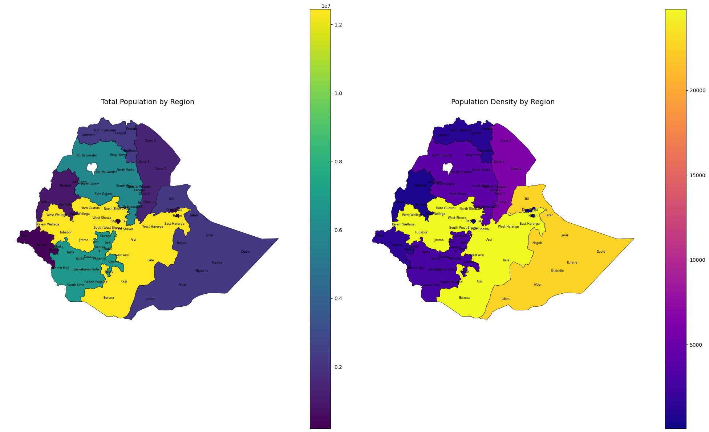

# Ethiopia Population & Density Analysis

## Project Overview
This project analyzes Ethiopia’s population distribution and density at the Woreda and Region levels using resampled WorldPop data. It highlights demographic patterns and provides recruiter‑friendly visualizations.

## Data Sources
- WorldPop 100m raster (resampled to 1km)
- Ethiopia administrative boundaries (Woreda shapefiles)

## Methodology
- Resampled raster for computational feasibility
- Zonal statistics (population sum, mean density per Woreda)
- Regional aggregation for summaries
- Visualizations (bar charts, choropleths with labels)

## Results

### Total Population by Region
.png)

### Population by Region
.png)

### Population Density by Region
.png)

### Population Density by Woreda

## Key Insights
- 🌍 Oromia and Amhara show the highest total populations.
- 🏙️ Addis Ketema and Lideta Woredas have the highest densities.
- 📈 Density patterns reveal urban concentration but also highlight rural spread.

## Next Steps
Future work will expand into a multi‑factor Urban Accessibility Index, incorporating:
- Service reach (health, education, markets, transport hubs)
- Mobility friction (road density, terrain slope, congestion proxies)
- Demand pressure (population‑to‑service ratios)
